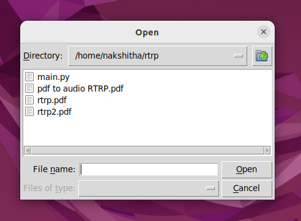

<div align="center">

# 📖 PDF to Audio Converter

An intuitive Python tool that reads text from PDF documents and converts it into natural speech using text-to-speech (TTS) technology.

<!-- Badges -->


</div>

---

## 📌 Overview

The **PDF to Audio Converter** allows users to select any PDF document through a graphical file dialog and listen to its contents page by page. It bridges the gap between text and accessibility, allowing users to listen to study materials, books, and reports on the go.

---

## ✨ Features

* 📂 **Interactive File Picker:** Browse and select any `.pdf` file seamlessly.
* 🗣️ **Text-to-Speech Engine:** Reads the entire document page by page in real time.
* ⚡ **Offline Support:** Works completely offline without needing an active internet connection or paid API keys.

---

## 🛠️ Tech Stack & Dependencies

* **Python 3**
* **`pyttsx3`** (Offline Text-to-Speech library)
* **`PyPDF2`** (PDF parsing library)
* **`tkinter`** (File dialog interface)

---

## 🚀 How to Run Locally

1. **Clone the repository:**
   ```bash
   git clone [https://github.com/KNakshitha/pdf-to-audio-converter.git](https://github.com/KNakshitha/pdf-to-audio-converter.git)
   cd pdf-to-audio-converter
   ```

2. **Install dependencies:**
   ```bash
   pip install pyttsx3 PyPDF2
   ```

3. **Run the script:**
   ```bash
   python3 main.py
   ```

4. **Select a PDF from the file dialog prompt and listen!**
   
5.

 
